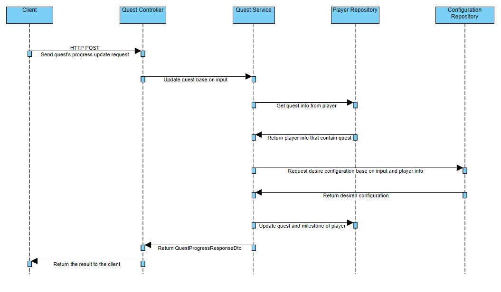

# PlayStudio Coding Challenge
This is the project for PlayStudios coding challenge.
## Getting started ##
 - To run this project: .Net 8 is required and MongoDB if you don't want to use the connect I already set in appSettings.json
 - Before running the project, please contact me or through some contact point to get the password for the MongoDB connection and replace 'password' in appSettings.Development.json
 - Run the project with Visual Studio and use Swagger to test the API.
 - If the project no longer able to connect to the database on cloud, please change it to your desired connection.
## Data & Testing ##
 - Data will be seeded at the startup time of project, if data already have, it'll skip the seeding process.
 - After the project is built, you can test it via the Swagger
 - There is a endpoint that allow you to retrieve the player's ID so you won't need to use any management tool to connect and view data directly from database.
## Sequence diagram of milestone


## Quest Configuration
There're two type of configuration which will be added to configuration collection. Each configuration type will be a set.
#### BetBonusRate: 
When the number of chips bet equal or greater than BetAmount, the amount is multiplied by provided Rate.
```
    [
        {
            "BetAmount": [int],
            "Rate": [double]
        },
        ...
    ]
```
#### LevelBonusRate: 
When player's level is equal or greater Level, player will receive a bonus level rate.
```
    [
        {
            "Level": [int],
            "Rate": [double]
        },
        ...
    ]
```
## Player, Quest schema
Quest will be stored inside the player schema:
```
{
    "Id": [id],
    "PlayerName": [string],
    "Quests": 
    [
        {
            "Id": [id],
            "QuestTitle": [string],
            "CurrentPoint": [double],
            "TargetPoint": [double],
            "NumberOfMilestones": [int],
            "IsComplete": [bool],
            "IsActive": [bool],
            "Milestones":
            [
                {
                    "Index": [int],
                    "Title": [string],
                    "RequiredPoint": [double],
                    "Reward": [double],
                    "IsComplete": [bool]
                },
                ...
            ]
        },
        ...
    ]
}
```
#### Player Schema Explanation:
- Id: is the player's ID.
- PlayerName: name of the player.
- Quests: quest list of player.

#### Quest Schema Explanation:
- Id: is the quest's ID.
- QuestTitle: title of the quest.
- CurrentPoint: point that earned for the quest so far.
- TargetPoint: required point need to complete the quest.
- NumberOfMilestones: milestone count of this quest.
- IsComplete: is the quest complete or not.
- IsActive: is the quest active or not.
- Milestones: quest's milestone list.

#### Milestone Schema Explanation:
- Index: the index of milestone in the quest.
- Title: milestone title.
- RequiredPoint: point need to archive to complete the milestone.
- Reward: reward when finish the milestone.
- IsComplete: is the Milestone completed or not.
